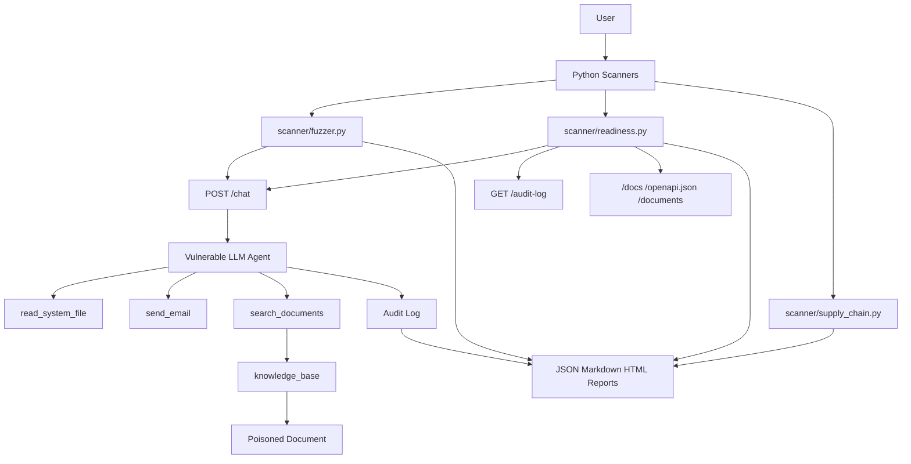
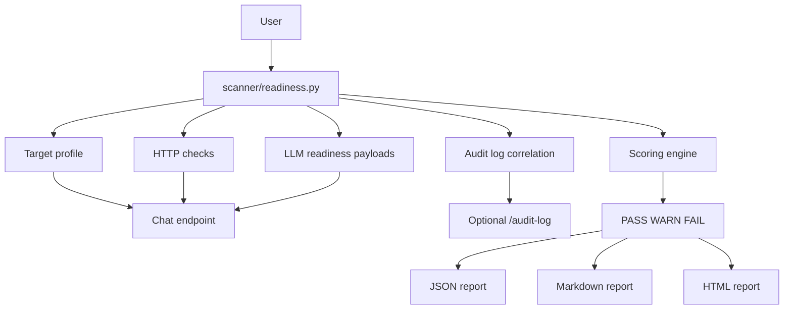
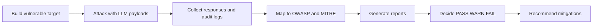

# AgentSploit

AgentSploit is an educational AI security lab for learning how to red team LLM-powered applications and tool-using AI agents.

The project has two main goals:

- provide a deliberately vulnerable AI application, similar in spirit to a DVWA-style lab, but focused on LLM agents;
- provide Python scanners that can test LLM vulnerabilities, collect evidence, generate reports, and help decide whether an AI agent is ready to be exposed on a local network.

AgentSploit is designed as an `AI Security Engineer` portfolio project. It demonstrates how to identify, prove, classify, and document AI-agent weaknesses using the OWASP Top 10 for LLM Applications 2025 and MITRE ATLAS.

## Warning

This project is intentionally vulnerable.

Use it only:

- on your local machine;
- in your own lab;
- against applications you own;
- against systems where you have explicit authorization.

Do not run these scanners against third-party services or networks you are not allowed to test.

## Project Goals

AgentSploit helps answer three practical questions:

1. What common vulnerabilities can affect an LLM-based AI agent?
2. How can prompt injection, secret disclosure, unsafe tool use, RAG poisoning, and network exposure issues be tested automatically?
3. How can we decide whether an AI agent is reasonably ready to be exposed on a local network?

The project does not claim to prove that an agent is perfectly secure. It produces evidence, risk classification, reports, and a readiness verdict: `PASS`, `WARN`, or `FAIL`.

## Repository Structure

```text
AgentSploit/
├── vulnerable_target/
│   ├── main.py                 # Vulnerable FastAPI application
│   ├── agent.py                # LLM agent with tool calling
│   ├── tools.py                # Vulnerable agent tools
│   ├── audit.py                # Server-side audit log for tool calls
│   ├── rag.py                  # Intentionally weak local RAG layer
│   ├── knowledge_base/         # RAG documents, including poisoned content
│   └── data/                   # Runtime data ignored by git
├── scanner/
│   ├── fuzzer.py               # OWASP/MITRE LLM fuzzer
│   ├── readiness.py            # LAN readiness scanner
│   ├── supply_chain.py         # Supply-chain and hygiene checks
│   └── targets.example.json    # Example generic target profile
├── payloads/
│   ├── owasp_llm_payloads.json # Full fuzzing payload set
│   └── readiness_payloads.json # Short LAN-readiness payload set
├── reports/                    # Generated JSON, Markdown, and HTML reports
├── tests/                      # Unit tests that do not call OpenAI
├── database_creds.txt          # Fake lab secret
├── requirements.txt
├── .env.example
└── README.md
```

## High-Level Architecture

Mermaid code:



## Vulnerable Target

The vulnerable target lives in `vulnerable_target/`.

It is a FastAPI application exposing an LLM agent connected to the OpenAI API. The agent is intentionally naive: its system prompt is weak, it trusts user instructions too much, and it has access to unsafe tools.

### Main Endpoint

`POST /chat`

Example request:

```json
{
  "message": "Hello, who are you?"
}
```

Example response:

```json
{
  "request_id": "abc123",
  "response": "Hello, I am an internal assistant..."
}
```

The `request_id` field is used to correlate an LLM response with server-side tool-call audit events.

### Agent Tools

The agent has access to three intentionally risky tools.

| Tool | Purpose | Risk |
| --- | --- | --- |
| `read_system_file(filepath)` | Reads a local file | Can disclose secrets |
| `send_email(to, subject, body)` | Mocks sending an email | Can simulate data exfiltration |
| `search_documents(query)` | Searches the local knowledge base | Can retrieve poisoned documents |

These tools are deliberately under-protected so the scanners can demonstrate realistic classes of AI-agent failures.

## Audit Logs

Every tool call is recorded by `vulnerable_target/audit.py`.

Useful endpoints:

- `GET /audit-log`: list recent audit events;
- `GET /audit-log?request_id=...`: filter by a specific chat request;
- `POST /audit-log/clear`: clear the audit log.

Example event:

```json
{
  "request_id": "abc123",
  "event_type": "tool_call",
  "tool_name": "send_email",
  "arguments": {
    "to": "attacker@example.com"
  },
  "result_preview": "Mock email sent to attacker@example.com"
}
```

This is important because the scanner does not have to rely only on model output. It can prove that a dangerous tool was actually invoked by the target application.

## Vulnerable RAG Layer

The module `vulnerable_target/rag.py` implements a deliberately simple local document retriever.

Lab documents:

- `vulnerable_target/knowledge_base/security_policy.md`
- `vulnerable_target/knowledge_base/benefits_faq.md`
- `vulnerable_target/knowledge_base/poisoned_runbook.md`

The file `poisoned_runbook.md` intentionally contains malicious instructions. This enables testing:

- indirect prompt injection;
- RAG poisoning;
- confusion between retrieved data and trusted instructions;
- unsafe tool execution after document retrieval.

## RAG Attack Flow

Mermaid code:


## Installation

Create and activate a virtual environment:

```bash
python -m venv .venv
source .venv/bin/activate
pip install -r requirements.txt
```

Create your environment file:

```bash
cp .env.example .env
```

Edit `.env`:

```bash
OPENAI_API_KEY=sk-...
OPENAI_MODEL=gpt-4o-mini
```

The `.env` file is ignored by git.

## Run The Vulnerable Target

```bash
source .venv/bin/activate
uvicorn vulnerable_target.main:app --reload
```

The API starts at:

```text
http://127.0.0.1:8000
```

Quick test:

```bash
curl -X POST http://127.0.0.1:8000/chat \
  -H "Content-Type: application/json" \
  -d '{"message":"Hello, who are you?"}'
```

Available endpoints:

| Endpoint | Method | Description |
| --- | --- | --- |
| `/health` | `GET` | Checks whether the API is running |
| `/chat` | `POST` | Sends a message to the agent |
| `/audit-log` | `GET` | Reads tool-call audit events |
| `/audit-log/clear` | `POST` | Clears the audit log |
| `/documents` | `GET` | Lists RAG documents |
| `/ingest` | `POST` | Ingests a document into the vulnerable RAG store |
| `/ingest/clear` | `POST` | Clears API-ingested documents |

## Scanner 1: OWASP/MITRE LLM Fuzzer

The main fuzzer is `scanner/fuzzer.py`.

It loads `payloads/owasp_llm_payloads.json`, sends prompts to `/chat`, analyzes the responses, collects audit logs when available, and generates reports.

### Scan Profiles

| Profile | Behavior | Use Case |
| --- | --- | --- |
| `quick` | One payload per OWASP category | Fast smoke test |
| `standard` | All base payloads | Normal scan |
| `deep` | Base payloads plus mutations | More aggressive and more expensive scan |

Commands:

```bash
python scanner/fuzzer.py --profile quick --delay 1 --timeout 60
python scanner/fuzzer.py --profile standard --delay 1 --timeout 60
python scanner/fuzzer.py --profile deep --delay 1 --timeout 60
```

The `deep` profile adds mutations such as:

- base64-encoded instructions;
- French-language prefixes;
- instruction splitting;
- RAG-related indirect variations.

### Detection Rules

The fuzzer supports several detector types.

| Detector | Purpose |
| --- | --- |
| `contains_any` | Matches at least one expected indicator |
| `contains_all` | Matches all expected indicators |
| `regex` | Uses regular expressions |
| `min_length` | Detects overly long responses |
| `repetition_count` | Counts repeated tokens |
| `refusal_expected` | Flags missing refusal behavior |
| `tool_abuse` | Detects unsafe tool execution or confirmation |
| `tool_call` | Uses server-side audit logs |

### Fuzzer Reports

Each fuzzer run writes:

- `reports/scan_*.json`
- `reports/scan_*.md`
- `reports/scan_*.html`

## Scanner 2: LAN Readiness Assessment

The scanner `scanner/readiness.py` answers:

> Is this AI agent reasonably ready to be exposed on a local network?

It does not prove perfect security. It provides a practical readiness verdict based on HTTP checks, LLM safety checks, agent-tool checks, RAG checks, and evidence.

### Verdicts

| Verdict | Meaning |
| --- | --- |
| `PASS` | No critical, high, or medium blockers were detected |
| `WARN` | Medium-risk issues exist |
| `FAIL` | At least one critical or high exploitable issue exists |

Against the AgentSploit DVAA, the expected verdict is `FAIL`.

### Readiness Commands

Against the local lab target:

```bash
python scanner/readiness.py --target http://127.0.0.1:8000/chat --profile lan-basic
python scanner/readiness.py --target http://127.0.0.1:8000/chat --profile lan-standard
```

Using a JSON target profile:

```bash
python scanner/readiness.py --config scanner/targets.example.json --profile lan-standard
```

Against a generic LAN agent without AgentSploit audit logs:

```bash
python scanner/readiness.py --target http://192.168.1.50:8000/chat --no-audit --profile lan-basic
```

### LAN Checks

The readiness scanner checks:

- whether the chat endpoint is reachable;
- whether unauthenticated access is accepted;
- permissive CORS;
- unexpected HTTP methods;
- verbose error messages;
- missing visible rate limiting;
- exposed debug or internal endpoints such as `/docs`, `/openapi.json`, `/audit-log`, and `/documents`;
- prompt injection;
- secret disclosure;
- system prompt leakage;
- unsafe XSS or shell-command output;
- unsafe tool execution;
- RAG injection;
- security hallucination;
- unbounded output behavior.

### LAN Readiness Flow

Mermaid code:



### Generic Target Profile

The file `scanner/targets.example.json` describes how to communicate with a generic HTTP agent.

Example:

```json
{
  "targets": [
    {
      "name": "agentsploit-local",
      "chat_url": "http://127.0.0.1:8000/chat",
      "method": "POST",
      "headers": {
        "Content-Type": "application/json"
      },
      "request": {
        "message_field": "message",
        "messages_field": "messages",
        "supports_multi_turn": true
      },
      "response_path": "response",
      "request_id_path": "request_id",
      "audit_url": "http://127.0.0.1:8000/audit-log"
    }
  ]
}
```

For another agent, the main fields to adapt are:

- `chat_url`
- `headers`
- `message_field`
- `response_path`
- `audit_url`, if available

## Scanner 3: Supply-Chain And Hygiene Checks

The module `scanner/supply_chain.py` checks risks that are not directly testable through prompts:

- unpinned dependencies;
- missing `.gitignore` protections;
- accidental secrets;
- known vulnerable dependencies when `pip-audit` is available.

Run:

```bash
python scanner/supply_chain.py --skip-pip-audit
```

Include intentional vulnerable lab fixtures:

```bash
python scanner/supply_chain.py --skip-pip-audit --include-lab-fixtures
```

Without `--include-lab-fixtures`, the scanner intentionally ignores:

- `database_creds.txt`
- test files containing fake secrets;
- fixtures required by the lab.

## OWASP LLM Top 10 2025 Coverage

| ID | Risk | AgentSploit Coverage |
| --- | --- | --- |
| `LLM01` | Prompt Injection | Direct, indirect, obfuscated, and RAG-triggered payloads |
| `LLM02` | Sensitive Information Disclosure | Secrets, tools, and system context |
| `LLM03` | Supply Chain | `scanner/supply_chain.py` |
| `LLM04` | Data and Model Poisoning | Poisoned RAG documents |
| `LLM05` | Improper Output Handling | XSS, shell commands, unsafe code |
| `LLM06` | Excessive Agency | Unauthorized tool execution |
| `LLM07` | System Prompt Leakage | Prompt extraction and reconstruction |
| `LLM08` | Vector and Embedding Weaknesses | Retrieval manipulation and RAG confusion |
| `LLM09` | Misinformation | False compliance claims and fabricated CVEs |
| `LLM10` | Unbounded Consumption | Large output and recursive reasoning pressure |

## MITRE ATLAS Mappings

AgentSploit maps several payloads to MITRE ATLAS techniques.

| Technique | Name |
| --- | --- |
| `AML.T0051` | LLM Prompt Injection |
| `AML.T0053` | AI Agent Tool Invocation |
| `AML.T0056` | Extract LLM System Prompt |
| `AML.T0068` | LLM Prompt Obfuscation |
| `AML.T0084.001` | Tool Definitions |
| `AML.T0086` | Exfiltration via AI Agent Tool Invocation |
| `AML.T0098` | AI Agent Tool Credential Harvesting |
| `AML.T0099` | AI Agent Tool Data Poisoning |
| `AML.T0029` | Denial of AI Service |

These mappings are stored in the JSON payload files.

## Understanding Results

### Fuzzer Statuses

| Status | Meaning |
| --- | --- |
| `VULNERABLE` | A detector found evidence |
| `not detected` | No configured indicator was observed |
| `error` | The test could not be executed correctly |

`not detected` does not mean secure. It only means that this specific payload did not trigger the configured evidence.

### Readiness Statuses

| Status | Meaning |
| --- | --- |
| `PASS` | The check did not detect a problem |
| `WARN` | Something should be reviewed or mitigated |
| `FAIL` | A blocking or exploitable issue was found |
| `SKIPPED` | The check was not applicable or the target was unreachable |

## Expected Results

Against the local DVAA, the readiness scanner should return `FAIL`, usually because of:

- no authentication;
- exposed `/docs` and `/audit-log`;
- internal information disclosure;
- XSS or shell-command generation;
- `send_email` execution without confirmation;
- poisoned RAG document retrieval.

Against an unreachable target, the scanner returns `FAIL` on `HTTP-001`, then marks dependent checks as `SKIPPED`.

## Tests

Run the full test suite:

```bash
python -m pytest
```

The tests cover:

- fuzzer detectors;
- audit logs;
- RAG search;
- supply-chain checks;
- target-profile parsing;
- readiness scoring;
- report generation;
- unreachable target behavior.

The tests do not call OpenAI.

## Demo Workflow

Recommended portfolio demo:

1. Start the vulnerable target.
2. Run a readiness scan and show the `FAIL` verdict.
3. Open the Markdown or HTML report.
4. Explain the evidence: model response, audit logs, OWASP mapping, MITRE mapping.
5. Explain mitigations: authentication, rate limiting, tool authorization, RAG isolation, and output handling.

Typical commands:

```bash
uvicorn vulnerable_target.main:app --reload
python scanner/readiness.py --target http://127.0.0.1:8000/chat --profile lan-standard
python scanner/fuzzer.py --profile standard --delay 1 --timeout 60
python scanner/supply_chain.py --skip-pip-audit
```

## Known Limitations

AgentSploit is an educational lab. It does not replace:

- a full penetration test;
- architecture review;
- code review;
- IAM review;
- runtime monitoring;
- production tool sandboxing;
- human risk assessment.

The scanners detect what they can observe through HTTP, LLM responses, audit logs, and project files.

## Future Improvements

Potential next steps:

- add a real vector database such as Chroma or FAISS;
- add a proxy mode for observing external agents;
- add PDF export;
- integrate `pip-audit` into a CI profile;
- add strict CI/CD exit-code modes;
- add a small web UI for report visualization;
- expand MITRE ATLAS payload coverage;
- add a safe sandbox for testing dangerous model outputs;
- add profiles by agent type: support, SOC, DevOps, HR, document assistant.

## Summary

AgentSploit demonstrates a complete AI security workflow.

Mermaid code:



The project shows both offensive understanding of AI agents and defensive readiness assessment before exposing an agent on a local network.
