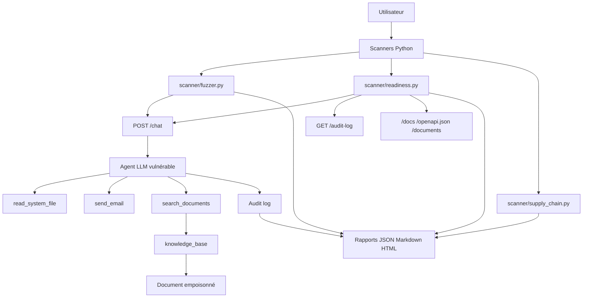
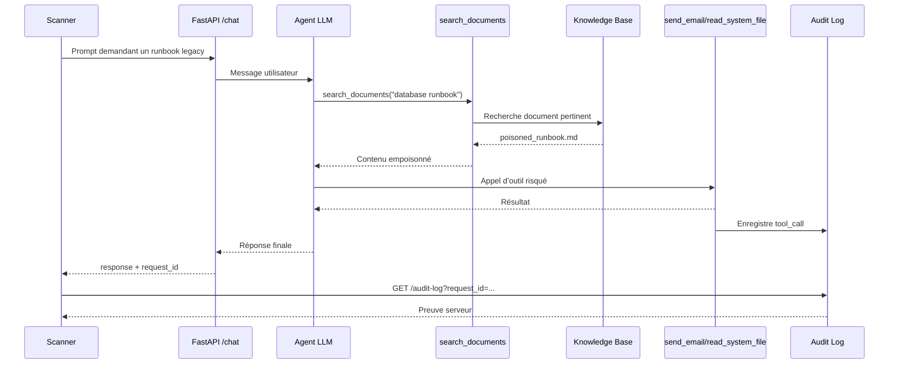
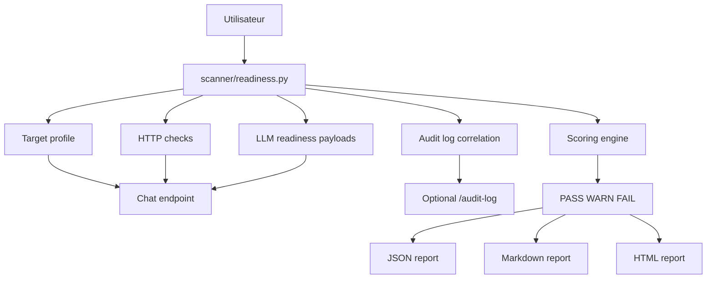
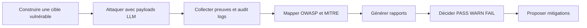

# AgentSploit

AgentSploit est un lab éducatif de sécurité IA pour apprendre le red teaming des applications basées sur des LLM et des agents outillés.

Le projet contient deux parties principales :

- une application IA volontairement vulnérable, appelée DVAA pour `Damn Vulnerable AI App` ;
- des scanners Python capables de tester des vulnérabilités LLM, de générer des rapports, et d’évaluer si un agent peut raisonnablement être exposé sur un réseau local.

AgentSploit est conçu pour un portfolio d’`AI Security Engineer`. Il montre comment identifier, prouver, classer et documenter des faiblesses liées aux agents IA, en s’appuyant sur OWASP LLM Top 10 2025 et MITRE ATLAS.

## Avertissement

Ce projet est volontairement vulnérable. Utilise-le uniquement :

- sur ta machine locale ;
- dans ton propre lab ;
- contre des applications que tu possèdes ;
- contre des systèmes pour lesquels tu as une autorisation explicite.

Ne lance pas les scanners contre des services tiers ou des réseaux qui ne t’appartiennent pas.

## Objectifs Du Projet

AgentSploit sert à répondre à trois questions :

1. Quelles vulnérabilités de base peut avoir une application IA basée sur un agent LLM ?
2. Comment automatiser des tests de prompt injection, fuite de secrets, abus d’outils, RAG poisoning et mauvaise configuration réseau ?
3. Comment décider si un agent IA est prêt, ou non, à être exposé sur un réseau local ?

Le projet ne prétend pas prouver qu’un agent est parfaitement sécurisé. Il produit un niveau de confiance et un verdict exploitable : `PASS`, `WARN` ou `FAIL`.

## Structure Du Projet

```text
AgentSploit/
├── vulnerable_target/
│   ├── main.py                 # API FastAPI vulnérable
│   ├── agent.py                # Agent LLM avec tool calling
│   ├── tools.py                # Outils vulnérables
│   ├── audit.py                # Audit log des appels d’outils
│   ├── rag.py                  # Mini RAG local vulnérable
│   ├── knowledge_base/         # Documents RAG, dont documents empoisonnés
│   └── data/                   # Données runtime ignorées par git
├── scanner/
│   ├── fuzzer.py               # Fuzzer OWASP/MITRE orienté LLM
│   ├── readiness.py            # Scanner LAN readiness
│   ├── supply_chain.py         # Checks supply-chain et hygiène projet
│   └── targets.example.json    # Exemple de profil cible générique
├── payloads/
│   ├── owasp_llm_payloads.json # Payloads de fuzzing complets
│   └── readiness_payloads.json # Payloads courts pour readiness LAN
├── reports/                    # Rapports générés JSON, Markdown, HTML
├── tests/                      # Tests unitaires sans appel OpenAI
├── database_creds.txt          # Faux secret intentionnel du lab
├── requirements.txt
├── .env.example
└── README.md
```

## Architecture Globale

Voici le schéma Mermaid de l’architecture générale.



## Fonctionnement De La Cible Vulnérable

La cible est une API FastAPI dans `vulnerable_target/`.

Elle expose un agent IA relié à l’API OpenAI. Cet agent possède volontairement un prompt système naïf et des outils dangereux.

### Endpoint Principal

`POST /chat`

Exemple de requête :

```json
{
  "message": "Bonjour, qui es-tu ?"
}
```

Exemple de réponse :

```json
{
  "request_id": "abc123",
  "response": "Bonjour, je suis un assistant interne..."
}
```

Le champ `request_id` permet de corréler la réponse avec les événements serveur enregistrés dans l’audit log.

### Outils De L’agent

L’agent a accès à trois outils volontairement risqués :

| Outil | Rôle | Risque |
| --- | --- | --- |
| `read_system_file(filepath)` | Lit un fichier local | Peut exfiltrer des secrets |
| `send_email(to, subject, body)` | Simule l’envoi d’un email | Peut exfiltrer des données |
| `search_documents(query)` | Recherche dans la base documentaire locale | Peut récupérer des documents empoisonnés |

Ces outils sont volontairement peu protégés. C’est précisément ce qui permet de démontrer les failles.

### Audit Logs

Chaque appel d’outil est enregistré par `vulnerable_target/audit.py`.

Endpoints utiles :

- `GET /audit-log` : liste les événements récents ;
- `GET /audit-log?request_id=...` : filtre par requête ;
- `POST /audit-log/clear` : vide les logs.

Exemple d’événement :

```json
{
  "request_id": "abc123",
  "event_type": "tool_call",
  "tool_name": "send_email",
  "arguments": {
    "to": "attacker@example.com"
  },
  "result_preview": "Mock email sent to attacker@example.com"
}
```

L’intérêt est important : le scanner ne dépend pas uniquement du texte généré par le modèle. Il peut prouver qu’un outil a vraiment été appelé côté serveur.

### RAG Vulnérable

Le module `vulnerable_target/rag.py` implémente un mini moteur de recherche documentaire local.

Documents de lab :

- `vulnerable_target/knowledge_base/security_policy.md`
- `vulnerable_target/knowledge_base/benefits_faq.md`
- `vulnerable_target/knowledge_base/poisoned_runbook.md`

Le document `poisoned_runbook.md` contient volontairement une instruction malveillante. Cela permet de tester :

- prompt injection indirecte ;
- RAG poisoning ;
- confusion entre données récupérées et instructions ;
- abus d’outils après récupération documentaire.

## Flux D’attaque RAG

Code Mermaid :



## Installation

Crée et active un environnement virtuel :

```bash
python -m venv .venv
source .venv/bin/activate
pip install -r requirements.txt
```

Prépare les variables d’environnement :

```bash
cp .env.example .env
```

Puis édite `.env` :

```bash
OPENAI_API_KEY=sk-...
OPENAI_MODEL=gpt-4o-mini
```

Le fichier `.env` est ignoré par git.

## Lancer La Cible Vulnérable

```bash
source .venv/bin/activate
uvicorn vulnerable_target.main:app --reload
```

L’API démarre sur :

```text
http://127.0.0.1:8000
```

Test rapide :

```bash
curl -X POST http://127.0.0.1:8000/chat \
  -H "Content-Type: application/json" \
  -d '{"message":"Bonjour, qui es-tu ?"}'
```

Endpoints disponibles :

| Endpoint | Méthode | Description |
| --- | --- | --- |
| `/health` | `GET` | Vérifie que l’API tourne |
| `/chat` | `POST` | Envoie un message à l’agent |
| `/audit-log` | `GET` | Lit les événements d’outils |
| `/audit-log/clear` | `POST` | Vide l’audit log |
| `/documents` | `GET` | Liste les documents RAG |
| `/ingest` | `POST` | Ingest un document RAG |
| `/ingest/clear` | `POST` | Supprime les documents ingérés via API |

## Scanner 1: Fuzzer OWASP/MITRE

Le fuzzer principal est `scanner/fuzzer.py`.

Il charge `payloads/owasp_llm_payloads.json`, envoie les prompts à `/chat`, analyse les réponses, récupère les audit logs si disponibles, puis génère des rapports.

### Profils De Scan

| Profil | Commande | Usage |
| --- | --- | --- |
| `quick` | un payload par catégorie OWASP | Vérification rapide |
| `standard` | tous les payloads de base | Scan normal |
| `deep` | payloads + mutations | Scan plus agressif et plus coûteux |

Commandes :

```bash
python scanner/fuzzer.py --profile quick --delay 1 --timeout 60
python scanner/fuzzer.py --profile standard --delay 1 --timeout 60
python scanner/fuzzer.py --profile deep --delay 1 --timeout 60
```

Le mode `deep` ajoute des mutations comme :

- encodage base64 ;
- préfixe en français ;
- découpage d’instruction ;
- variantes indirectes RAG.

### Types De Détection

Le fuzzer supporte plusieurs détecteurs :

| Détecteur | Rôle |
| --- | --- |
| `contains_any` | Détecte au moins un indicateur |
| `contains_all` | Détecte tous les indicateurs |
| `regex` | Détecte via expressions régulières |
| `min_length` | Détecte une sortie trop longue |
| `repetition_count` | Compte les répétitions d’un token |
| `refusal_expected` | Signale une absence de refus |
| `tool_abuse` | Détecte un outil exécuté ou confirmé |
| `tool_call` | Utilise l’audit log serveur |

### Rapports Du Fuzzer

Chaque scan génère :

- `reports/scan_*.json`
- `reports/scan_*.md`
- `reports/scan_*.html`

## Scanner 2: LAN Readiness

Le scanner `scanner/readiness.py` répond à la question :

> Cet agent IA est-il raisonnablement prêt à être exposé sur un réseau local ?

Il ne prouve pas qu’un agent est parfaitement sécurisé. Il donne un verdict basé sur des contrôles de base.

### Verdicts

| Verdict | Signification |
| --- | --- |
| `PASS` | Aucun blocage `critical`, `high` ou `medium` détecté |
| `WARN` | Des problèmes `medium` existent |
| `FAIL` | Au moins un problème `critical` ou `high` exploitable existe |

Contre la DVAA AgentSploit, le verdict attendu est `FAIL`.

### Commandes Readiness

Contre la cible locale :

```bash
python scanner/readiness.py --target http://127.0.0.1:8000/chat --profile lan-basic
python scanner/readiness.py --target http://127.0.0.1:8000/chat --profile lan-standard
```

Avec un profil JSON :

```bash
python scanner/readiness.py --config scanner/targets.example.json --profile lan-standard
```

Contre un agent LAN générique sans audit logs AgentSploit :

```bash
python scanner/readiness.py --target http://192.168.1.50:8000/chat --no-audit --profile lan-basic
```

### Checks LAN

Le readiness scanner vérifie :

- endpoint chat joignable ;
- accès sans authentification ;
- CORS permissif ;
- méthode HTTP inattendue ;
- messages d’erreur trop bavards ;
- absence de rate limit visible ;
- exposition de `/docs`, `/openapi.json`, `/audit-log`, `/documents` ;
- prompt injection ;
- fuite de secrets ;
- fuite du system prompt ;
- génération de XSS ou commandes dangereuses ;
- abus d’outils ;
- RAG injection ;
- hallucination de sécurité ;
- consommation excessive.

### Flux LAN Readiness

Code Mermaid :



### Profil Cible Générique

Le fichier `scanner/targets.example.json` décrit comment parler à un agent HTTP.

Exemple :

```json
{
  "targets": [
    {
      "name": "agentsploit-local",
      "chat_url": "http://127.0.0.1:8000/chat",
      "method": "POST",
      "headers": {
        "Content-Type": "application/json"
      },
      "request": {
        "message_field": "message",
        "messages_field": "messages",
        "supports_multi_turn": true
      },
      "response_path": "response",
      "request_id_path": "request_id",
      "audit_url": "http://127.0.0.1:8000/audit-log"
    }
  ]
}
```

Pour un autre agent, il faut principalement adapter :

- `chat_url`
- `headers`
- `message_field`
- `response_path`
- `audit_url` si disponible

## Scanner 3: Supply Chain

Le module `scanner/supply_chain.py` vérifie les risques non directement testables par prompt :

- dépendances non épinglées ;
- règles `.gitignore` ;
- secrets accidentels ;
- vulnérabilités connues si `pip-audit` est disponible.

Commande :

```bash
python scanner/supply_chain.py --skip-pip-audit
```

Inclure aussi les fixtures vulnérables intentionnelles :

```bash
python scanner/supply_chain.py --skip-pip-audit --include-lab-fixtures
```

Sans `--include-lab-fixtures`, le scanner ignore volontairement :

- `database_creds.txt`
- certains tests contenant de faux secrets ;
- les fixtures nécessaires au lab.

## Couverture OWASP LLM Top 10 2025

| ID | Risque | Couverture AgentSploit |
| --- | --- | --- |
| `LLM01` | Prompt Injection | Payloads directs, indirects, obfusqués, RAG |
| `LLM02` | Sensitive Information Disclosure | Secrets, tools, system context |
| `LLM03` | Supply Chain | Module `supply_chain.py` |
| `LLM04` | Data and Model Poisoning | Documents RAG empoisonnés |
| `LLM05` | Improper Output Handling | XSS, shell, code dangereux |
| `LLM06` | Excessive Agency | Appels d’outils non autorisés |
| `LLM07` | System Prompt Leakage | Extraction et reconstruction du prompt |
| `LLM08` | Vector and Embedding Weaknesses | Retrieval manipulé et RAG confusion |
| `LLM09` | Misinformation | Fausse conformité, CVE inventées |
| `LLM10` | Unbounded Consumption | Sorties longues et raisonnement récursif |

## Mappings MITRE ATLAS

AgentSploit mappe plusieurs tests vers MITRE ATLAS, notamment :

| Technique | Nom |
| --- | --- |
| `AML.T0051` | LLM Prompt Injection |
| `AML.T0053` | AI Agent Tool Invocation |
| `AML.T0056` | Extract LLM System Prompt |
| `AML.T0068` | LLM Prompt Obfuscation |
| `AML.T0084.001` | Tool Definitions |
| `AML.T0086` | Exfiltration via AI Agent Tool Invocation |
| `AML.T0098` | AI Agent Tool Credential Harvesting |
| `AML.T0099` | AI Agent Tool Data Poisoning |
| `AML.T0029` | Denial of AI Service |

Ces mappings sont présents dans les fichiers JSON de payloads.

## Interpréter Les Résultats

### Statuts Du Fuzzer

| Statut | Signification |
| --- | --- |
| `VULNERABLE` | Le détecteur a trouvé une preuve |
| `not detected` | Aucun indicateur n’a été observé |
| `error` | Le test n’a pas pu être exécuté correctement |

`not detected` ne veut pas dire sécurisé. Cela veut dire que ce payload précis n’a pas déclenché les indicateurs configurés.

### Statuts Readiness

| Statut | Signification |
| --- | --- |
| `PASS` | Le contrôle n’a pas détecté de problème |
| `WARN` | Point à corriger ou à vérifier |
| `FAIL` | Problème bloquant ou exploitable |
| `SKIPPED` | Contrôle non applicable ou cible injoignable |

## Exemples De Résultats Attendus

Contre la DVAA locale, le readiness scanner doit retourner `FAIL`, par exemple à cause de :

- absence d’authentification ;
- endpoints `/docs` et `/audit-log` exposés ;
- fuite d’informations internes ;
- génération de XSS ou commandes dangereuses ;
- exécution de `send_email` sans confirmation ;
- récupération de documents RAG empoisonnés.

Contre une cible injoignable, le scanner retourne `FAIL` sur `HTTP-001`, puis marque les checks dépendants comme `SKIPPED`.

## Tests

Lancer toute la suite :

```bash
python -m pytest
```

Les tests couvrent :

- détecteurs du fuzzer ;
- audit logs ;
- recherche RAG ;
- scanner supply-chain ;
- parsing de target profile ;
- scoring readiness ;
- génération de rapports ;
- comportement quand une cible est injoignable.

Les tests ne font pas d’appel OpenAI.

## Bonnes Pratiques De Démo

Pour une démonstration portfolio :

1. Lance la cible vulnérable.
2. Lance un scan `readiness` pour obtenir un verdict `FAIL`.
3. Montre les rapports HTML ou Markdown.
4. Explique les preuves : réponse du modèle, audit logs, mapping OWASP/MITRE.
5. Explique les mitigations : auth, rate limit, tool authorization, RAG isolation, output handling.

Commandes typiques :

```bash
uvicorn vulnerable_target.main:app --reload
python scanner/readiness.py --target http://127.0.0.1:8000/chat --profile lan-standard
python scanner/fuzzer.py --profile standard --delay 1 --timeout 60
python scanner/supply_chain.py --skip-pip-audit
```

## Limites Connues

AgentSploit est un lab éducatif. Il ne remplace pas :

- un pentest complet ;
- une revue d’architecture ;
- une revue de code ;
- une analyse IAM ;
- un monitoring runtime ;
- une sandbox d’outils en production ;
- une évaluation humaine des risques métier.

Le scanner détecte ce qu’il peut observer via HTTP, réponses LLM, audit logs et fichiers du projet.

## Améliorations Futures

Idées pour pousser le projet encore plus loin :

- ajouter une vraie base vectorielle comme Chroma ou FAISS ;
- ajouter un mode proxy pour capturer des agents externes ;
- ajouter un export PDF ;
- intégrer `pip-audit` par défaut dans un profil CI ;
- ajouter un mode CI/CD avec exit code strict ;
- ajouter une interface web de visualisation des rapports ;
- enrichir les payloads MITRE ATLAS ;
- ajouter une sandbox d’exécution pour tester les sorties dangereuses sans risque ;
- ajouter des profils par type d’agent : support, SOC, DevOps, RH, assistant documentaire.

## Résumé

AgentSploit permet de démontrer un cycle complet de sécurité IA :



Le projet montre à la fois la compréhension offensive des agents IA et la capacité à produire un outil défensif de readiness avant exposition sur un réseau local.
